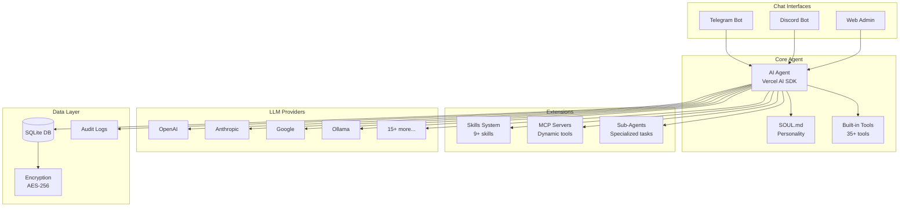

# MyBot - Self-Hosted AI Agent Platform

<div align="center">


[](LICENSE)
[](https://nodejs.org)
[](https://www.typescriptlang.org/)
[](package.json)
[](CONTRIBUTING.md)

**A powerful, self-hosted AI agent that gives you complete control over your server through natural language**

[Quick Start](#-quick-start) • [Features](#-features) • [Documentation](#-documentation) • [Demo](#-demo)

</div>

---

## 🌟 Why MyBot?

MyBot is not just another chatbot. It's a **production-ready AI agent platform** that turns your server into an intelligent assistant. Chat via Telegram or Discord, manage everything through a beautiful web dashboard, and extend capabilities with skills and MCP servers.

### ✨ What Makes MyBot Different?

- **🎯 True Agentic Behavior**: Uses Vercel AI SDK's Tool Loop for complex, multi-step reasoning
- **🔧 35+ Built-in Tools**: File management, Git operations, system monitoring, and more
- **🧩 Extensible Architecture**: Add skills, connect MCP servers, spawn sub-agents
- **🔐 Enterprise Security**: AES-256 encryption, user authentication, command confirmation
- **🌍 Cross-Platform**: Works on Windows, Linux, and macOS out of the box
- **🎨 Beautiful Admin Panel**: Modern Next.js web interface for configuration and monitoring
- **🤖 20+ LLM Providers**: OpenAI, Anthropic, Google, Groq, Ollama, and more

---

## 🚀 Features

### 💬 Multi-Platform Chat Interfaces

| Interface | Status | Features |
|-----------|--------|----------|
| **Telegram Bot** | ✅ Ready | Full streaming responses, rich formatting, file uploads |
| **Discord Bot** | ✅ Ready | Server integration, slash commands, role-based access |
| **Web Admin** | ✅ Ready | Real-time chat, conversation history, tool browser |
| **API** | ✅ Ready | RESTful API for custom integrations |

### 🛠️ Built-in Tools (35+ and growing)

<details>
<summary><b>📂 File Operations (10 tools)</b></summary>

- Read, write, create, delete files
- List directories with rich metadata
- Copy, move, rename operations
- Symbolic links and permissions
- Cross-platform path handling

</details>

<details>
<summary><b>📦 Git Operations (10 tools)</b></summary>

- Status, log, diff, branch management
- Stage, commit, push, pull
- Clone repositories
- Stash management
- Full Git workflow automation

</details>

<details>
<summary><b>🖥️ System Tools (9 tools)</b></summary>

- CPU, memory, disk monitoring
- Process management (list, kill)
- Network diagnostics (ping, curl)
- Service management (start, stop, restart)
- Environment variables
- Cross-platform commands

</details>

<details>
<summary><b>🔍 Search & Analysis (6 tools)</b></summary>

- Find files by pattern
- Search in files (grep/Select-String)
- Replace in files
- Count lines and words
- View file head/tail
- Regular expression support

</details>

### 🎨 Web Admin Dashboard

```
┌─────────────────────────────────────────┐
│  🏠 Dashboard                            │
│  ├─ 📊 Conversation Statistics          │
│  ├─ 🔧 Tool Usage Charts                │
│  ├─ 💬 Recent Conversations             │
│  └─ 📈 System Metrics                   │
│                                          │
│  ⚙️ Settings                             │
│  ├─ 🤖 LLM Providers (20+ supported)    │
│  ├─ 💬 Chat Interfaces (Telegram/Discord)│
│  ├─ 🧠 SOUL.md Personality Editor       │
│  ├─ 🧩 Skills Marketplace               │
│  └─ 🔌 MCP Server Connections           │
│                                          │
│  📚 Management                           │
│  ├─ 💭 Conversation History             │
│  ├─ 🔧 Tool Browser & Stats             │
│  ├─ 📝 System Logs (Real-time)          │
│  └─ 👥 User Management                  │
└─────────────────────────────────────────┘
```

### 🧩 Advanced Features

#### **Skills System** (Inspired by Vercel's Skills.sh)
Install pre-built skills or create custom ones:
- 🔐 **Security Audit** - Scan for vulnerabilities
- 🚀 **Deploy Assistant** - Automated deployment workflows
- 🗄️ **Database Helper** - SQL query assistance
- 🐳 **Docker Helper** - Container management
- 🔍 **Code Review** - Automated code analysis
- 🌐 **Web Search** - Internet search capabilities
- ⚡ **Performance Optimizer** - System optimization
- 🎯 **API Tester** - API testing and monitoring
- 🔧 **Git Helper** - Advanced Git workflows

#### **MCP (Model Context Protocol) Integration**
Connect to MCP servers for unlimited tool expansion:
```bash
# Connect to filesystem MCP server
mybot mcp connect npx -y @modelcontextprotocol/server-filesystem /path

# Connect to GitHub MCP server
mybot mcp connect npx -y @modelcontextprotocol/server-github

# Connect to custom MCP servers via stdio or SSE
```

#### **Sub-Agents**
Spawn specialized agents for complex tasks:
```typescript
// Automatically spawns expert agents when needed
"Deploy my app" → Spawns DeployAgent
"Audit security" → Spawns SecurityAgent
"Optimize database" → Spawns DatabaseAgent
```

#### **SOUL.md Personality System**
Customize your agent's behavior, tone, and expertise:
```markdown
# SOUL.md
You are a senior DevOps engineer with expertise in:
- Cloud infrastructure (AWS, GCP, Azure)
- Container orchestration (Kubernetes, Docker)
- CI/CD pipelines (GitHub Actions, GitLab CI)

Personality: Professional, proactive, security-conscious
Always: Explain what you're doing and why
Never: Execute destructive commands without confirmation
```

### 🔐 Security Features

- **🔒 Encrypted Storage**: AES-256-GCM for all API keys and secrets
- **👤 User Authentication**: Bcrypt password hashing, session management
- **✅ Whitelist Control**: Only approved users can interact with the bot
- **⚠️ Dangerous Command Detection**: Requires confirmation for risky operations
- **📝 Audit Logging**: Complete history of all actions and decisions
- **🛡️ Rate Limiting**: Protection against abuse (coming soon)

### 🌍 Supported LLM Providers (20+)

| Provider | Models | Status |
|----------|--------|--------|
| **OpenAI** | GPT-4o, GPT-4, GPT-3.5, O1, O3-mini | ✅ |
| **Anthropic** | Claude 3.5 Sonnet, Opus, Haiku | ✅ |
| **Google** | Gemini 2.0 Flash, 1.5 Pro/Flash | ✅ |
| **Groq** | Llama 3.3, Mixtral, Gemma | ✅ |
| **Ollama** | Any local model | ✅ |
| **Azure OpenAI** | GPT-4, GPT-3.5 | ✅ |
| **AWS Bedrock** | Claude, Llama | ✅ |
| **Mistral** | Mistral Large, Medium, Small | ✅ |
| **Cohere** | Command R+, Command | ✅ |
| **Together AI** | Llama, Mixtral | ✅ |
| **DeepSeek** | DeepSeek Chat | ✅ |
| **Perplexity** | Sonar Models | ✅ |
| **Fireworks** | Llama, Mixtral | ✅ |
| **xAI** | Grok | ✅ |
| **DeepInfra** | Various | ✅ |
| _...and more via OpenAI-compatible API_ | | |

---

## 📖 Documentation

| Document | Description |
|----------|-------------|
| **[Quick Start Guide](#-quick-start)** | Get started in 5 minutes |
| **[User Guide](docs/USER_GUIDE.md)** | Complete usage guide |
| **[Deployment Guide](docs/DEPLOYMENT.md)** | Production deployment |
| **[Developer Guide](docs/DEVELOPMENT.md)** | Build and extend MyBot |
| **[API Documentation](docs/API.md)** | REST API reference |
| **[Architecture](docs/ARCHITECTURE.md)** | System design & internals |
| **[Security Guide](docs/SECURITY.md)** | Security best practices |
| **[FAQ](docs/FAQ.md)** | Common questions |
| **[Changelog](docs/CHANGELOG.md)** | Version history |
| **[Contributing](CONTRIBUTING.md)** | How to contribute |

---

## ⚡ Quick Start

### Prerequisites

- **Node.js** 20+ ([Download](https://nodejs.org))
- **npm** or **pnpm**
- **Telegram Bot Token** (from [@BotFather](https://t.me/BotFather)) or **Discord Bot Token**

### Installation

#### Option 1: One-Line Install (Recommended)

```bash
curl -fsSL https://raw.githubusercontent.com/yourusername/mybot/main/scripts/install.sh | bash
```

#### Option 2: Manual Install

```bash
# 1. Clone the repository
git clone https://github.com/yourusername/mybot.git
cd mybot

# 2. Install dependencies
npm install

# 3. Configure environment
cp .env.example .env
nano .env  # Edit with your settings

# 4. Initialize database
npm run db:init

# 5. Start services
npm run dev          # Web admin (http://localhost:3000)
npm run bot          # Telegram bot (in another terminal)
npm run discord      # Discord bot (optional, in another terminal)
```

### Configuration

Edit `.env` file:

```env
# Admin Credentials
ADMIN_USERNAME=admin
ADMIN_PASSWORD=your-secure-password

# Security Keys
ENCRYPTION_KEY=your-64-char-hex-key  # Generate: openssl rand -hex 32
SESSION_SECRET=your-session-secret   # Generate: openssl rand -hex 32

# Telegram Bot
TELEGRAM_BOT_TOKEN=123456:ABC-DEF...
TELEGRAM_ALLOWED_USERS=123456789,987654321

# Discord Bot (optional)
DISCORD_BOT_TOKEN=your-discord-token
DISCORD_ALLOWED_GUILDS=server-id-1,server-id-2

# Default LLM Provider (configure via web admin or env)
DEFAULT_PROVIDER=openai
DEFAULT_MODEL=gpt-4o
OPENAI_API_KEY=sk-...
```

### First Steps

1. **Access Web Admin**: http://localhost:3000
2. **Add LLM Provider**: Settings → Providers → Add Provider
3. **Configure Bot**: Settings → Interfaces → Telegram/Discord
4. **Start Chatting**: Message your bot on Telegram/Discord!

---

## 🎬 Demo

### Telegram Bot Example

```
You: Show me what's in the /var/log directory

Bot: 📂 Listing /var/log directory...
     
     Found 15 files:
     📄 syslog (2.3 MB, modified 2 min ago)
     📄 auth.log (156 KB, modified 5 min ago)
     📄 nginx-access.log (45 MB, modified 1 min ago)
     📁 nginx/ (directory)
     ...

You: What's using the most CPU?

Bot: 🔍 Checking system processes...
     
     Top 5 CPU consumers:
     1. node (12.5%) - PID 1234
     2. nginx (3.2%) - PID 5678
     3. postgres (2.1%) - PID 9012
     
     System load: 0.45, 0.52, 0.48
     CPU usage: 23%
     Memory: 4.2GB / 8GB (52%)

You: Commit my changes with a good message

Bot: 🔍 Checking git status...
     
     Modified files:
     - src/agent/agent.ts
     - src/tools/system.ts
     
     📝 Creating commit...
     ✅ Committed: "feat: add system monitoring tools"
     
     Would you like me to push to origin?
```

### Web Admin Dashboard


---

## 🆚 Comparison with Alternatives

| Feature | MyBot | OpenClaw | AutoGPT | LangChain Bots |
|---------|-------|----------|---------|----------------|
| **Self-Hosted** | ✅ | ✅ | ✅ | ⚠️ Depends |
| **VPS Tools** | 35+ built-in | Limited | Plugin-based | Custom |
| **Multi-Platform Chat** | Telegram + Discord | CLI only | Web UI | Varies |
| **Web Admin** | ✅ Full-featured | ❌ | ⚠️ Basic | ❌ |
| **Skills System** | ✅ Marketplace | ❌ | ✅ Plugins | ⚠️ Custom |
| **MCP Support** | ✅ Native | ❌ | ❌ | ❌ |
| **Sub-Agents** | ✅ Dynamic | ❌ | ⚠️ Limited | ✅ |
| **20+ LLM Providers** | ✅ | ⚠️ Few | ⚠️ Few | ✅ |
| **Cross-Platform** | ✅ Win/Linux/Mac | ⚠️ Linux | ✅ | ✅ |
| **Production-Ready** | ✅ | ⚠️ Beta | ⚠️ Experimental | Varies |

---

## 🏗️ Architecture



**Learn more**: [Architecture Documentation](docs/ARCHITECTURE.md)

---

## 🛠️ Development

### Project Structure

```
mybot/
├── src/
│   ├── agent/              # AI agent core
│   │   ├── agent.ts        # Main agent with Vercel AI SDK
│   │   ├── providers.ts    # LLM provider registry (20+)
│   │   ├── soul.ts         # Personality system
│   │   ├── tools/          # Built-in tools (35+)
│   │   ├── skills/         # Skills system
│   │   ├── mcp/            # MCP client
│   │   └── subagents/      # Sub-agent manager
│   ├── bot/                # Chat interfaces
│   │   ├── index.ts        # Telegram bot
│   │   └── discord.ts      # Discord bot
│   ├── app/                # Next.js web admin
│   │   ├── api/            # API routes
│   │   ├── (dashboard)/    # Dashboard pages
│   │   └── login/          # Authentication
│   ├── database/           # SQLite database layer
│   ├── components/         # React components
│   └── lib/                # Shared utilities
├── skills/                 # Built-in skills
│   ├── security-audit/
│   ├── deploy-assistant/
│   ├── database-helper/
│   └── ...
├── docs/                   # Documentation
├── scripts/                # Installation & setup scripts
└── systemd/                # Production service files
```

### Adding Custom Tools

Create a new tool in `src/agent/tools/`:

```typescript
import { tool } from 'ai';
import { z } from 'zod';

export const myCustomTool = tool({
  description: 'Description of what this tool does',
  parameters: z.object({
    param1: z.string().describe('Parameter description'),
  }),
  execute: async ({ param1 }) => {
    // Your tool implementation
    return { success: true, result: 'Done!' };
  },
});
```

**Learn more**: [Developer Guide](docs/DEVELOPMENT.md)

---

## 🤝 Contributing

We welcome contributions! Please see our [Contributing Guide](CONTRIBUTING.md) for details.

### Ways to Contribute

- 🐛 **Report Bugs**: [Open an issue](https://github.com/yourusername/mybot/issues)
- 💡 **Request Features**: [Start a discussion](https://github.com/yourusername/mybot/discussions)
- 🔧 **Submit PRs**: Fix bugs or add features
- 📚 **Improve Docs**: Help make documentation better
- 🧩 **Create Skills**: Build and share custom skills
- ⭐ **Star the repo**: Show your support!

---

## 📜 License

MIT License - see [LICENSE](LICENSE) file for details.

---

## 🙏 Acknowledgments

MyBot is built on the shoulders of giants:

- [Vercel AI SDK](https://sdk.vercel.ai/) - AI framework and tool loop
- [Next.js](https://nextjs.org/) - React framework for web admin
- [Telegraf](https://telegraf.js.org/) - Telegram bot framework
- [Discord.js](https://discord.js.org/) - Discord bot library
- [better-sqlite3](https://github.com/WiseLibs/better-sqlite3) - Fast SQLite driver
- [Model Context Protocol](https://modelcontextprotocol.io/) - Tool extension standard

---

## 🔗 Links

- **Documentation**: [docs/](docs/)
- **Issues**: [GitHub Issues](https://github.com/yourusername/mybot/issues)
- **Discussions**: [GitHub Discussions](https://github.com/yourusername/mybot/discussions)
- **Twitter**: [@mybot](https://twitter.com/mybot)
- **Discord Community**: [Join Server](https://discord.gg/mybot)

---

## ⭐ Star History

[](https://star-history.com/#yourusername/mybot&Date)

---

<div align="center">

**Made with ❤️ by the MyBot community**

[⬆ Back to Top](#mybot---self-hosted-ai-agent-platform)

</div>
