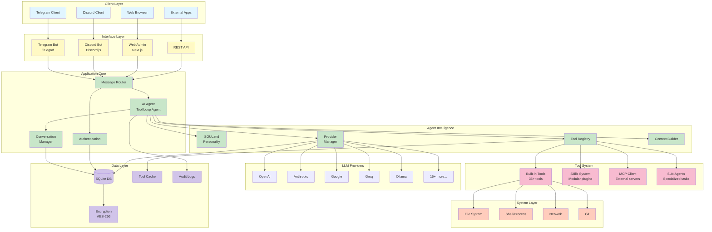
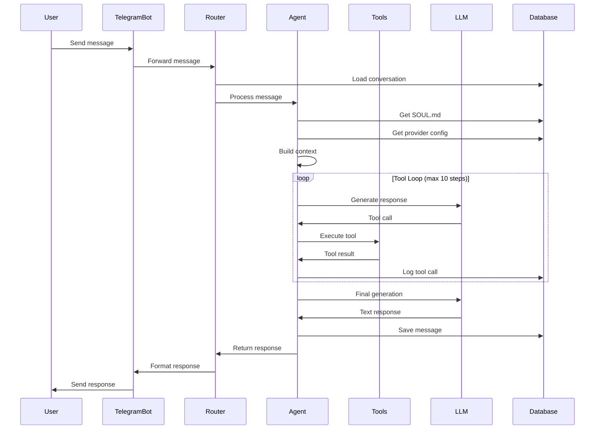
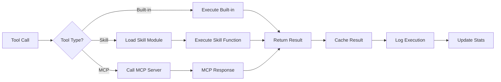
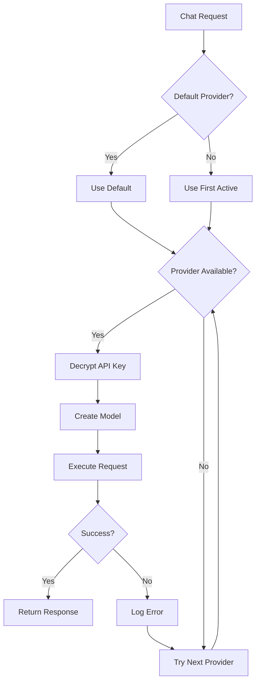
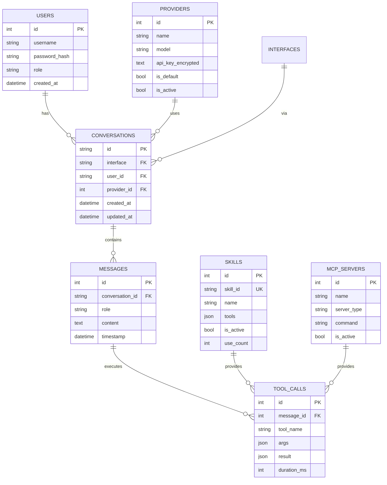

# 🏗️ System Architecture

Deep dive into Overseer's architecture, design decisions, and internals.

## Table of Contents

- [Overview](#overview)
- [System Diagram](#system-diagram)
- [Component Breakdown](#component-breakdown)
- [Data Flow](#data-flow)
- [Database Schema](#database-schema)
- [Security Model](#security-model)
- [Scalability Considerations](#scalability-considerations)
- [Technology Stack](#technology-stack)
- [Design Decisions](#design-decisions)

---

## Overview

Overseer is built as a **modular, extensible AI agent platform** using modern TypeScript and the Vercel AI SDK. The architecture follows a **layered design** with clear separation of concerns:

```
┌─────────────────────────────────────────────────────────┐
│                  Presentation Layer                     │
│         (Telegram, Discord, Web Admin, API)             │
└────────────────────┬────────────────────────────────────┘
                     │
┌────────────────────▼────────────────────────────────────┐
│                  Application Layer                      │
│         (Agent Core, Tool Loop, Conversation)           │
└────────────────────┬────────────────────────────────────┘
                     │
┌────────────────────▼────────────────────────────────────┐
│                    Domain Layer                         │
│     (Tools, Skills, MCP, Providers, Sub-Agents)         │
└────────────────────┬────────────────────────────────────┘
                     │
┌────────────────────▼────────────────────────────────────┐
│                  Infrastructure Layer                   │
│        (Database, Encryption, Logging, Auth)            │
└─────────────────────────────────────────────────────────┘
```

---

## System Diagram



---

## Component Breakdown

### 1. Presentation Layer

#### **Telegram Bot** (`src/bot/index.ts`)
- Uses **Telegraf** framework
- Supports streaming responses
- Rich formatting (markdown, buttons)
- File uploads/downloads
- Conversation context management

#### **Discord Bot** (`src/bot/discord.ts`)
- Uses **Discord.js**
- Slash commands
- Thread-based conversations
- Role-based access control
- Server-specific configurations

#### **Web Admin** (`src/app/`)
- **Next.js 14** with App Router
- React Server Components
- Server-side rendering (SSR)
- Real-time updates
- Responsive design (Tailwind CSS)

#### **REST API** (`src/app/api/`)
- RESTful endpoints
- Session-based authentication
- JSON request/response
- Error handling middleware
- Rate limiting (planned)

---

### 2. Application Layer

#### **AI Agent** (`src/agent/agent.ts`)

The heart of Overseer. Implements agentic behavior using **Vercel AI SDK v6**:

```typescript
export async function runAgent(
  message: string,
  conversationId: string,
  model: LanguageModel
): Promise<AgentResponse> {
  const tools = getAllAvailableTools();
  const systemPrompt = loadSoulPrompt();
  const history = getConversationHistory(conversationId);
  
  const result = await generateText({
    model,
    system: systemPrompt,
    messages: [...history, { role: 'user', content: message }],
    tools,
    maxSteps: 10, // Multi-step reasoning
  });
  
  return {
    response: result.text,
    toolsUsed: result.toolCalls?.map(tc => tc.toolName),
    usage: result.usage,
  };
}
```

**Key Features:**
- **Tool Loop**: Automatically executes multiple tools in sequence
- **Context Management**: Maintains conversation history
- **Streaming**: Supports real-time streaming responses
- **Error Recovery**: Graceful handling of tool failures
- **Token Management**: Tracks and limits token usage

#### **Conversation Manager** (`src/database/models/conversations.ts`)

Manages conversation state:

```typescript
interface Conversation {
  id: string;
  interface: 'telegram' | 'discord' | 'web' | 'api';
  userId: string;
  messages: Message[];
  created_at: string;
  updated_at: string;
}
```

**Features:**
- Per-user conversation history
- Message persistence
- Tool call tracking
- Usage analytics
- Automatic cleanup (configurable retention)

---

### 3. Domain Layer

#### **Tool System** (`src/agent/tools/`)

**Built-in Tools** (35+):

```typescript
// Example tool structure
export const systemInfo = tool({
  description: 'Get system information (CPU, memory, disk)',
  parameters: z.object({
    detailed: z.boolean().optional(),
  }),
  execute: async ({ detailed }) => {
    const cpuUsage = await getCPUUsage();
    const memUsage = await getMemoryUsage();
    const diskUsage = await getDiskUsage();
    
    return {
      cpu: cpuUsage,
      memory: memUsage,
      disk: diskUsage,
    };
  },
});
```

**Tool Categories:**
- **Shell**: Command execution (cross-platform)
- **Files**: CRUD operations
- **Git**: Repository management
- **System**: Monitoring and diagnostics
- **Search**: File and content search
- **Platform**: OS-specific commands

#### **Skills System** (`src/agent/skills/`)

Modular plugin architecture inspired by Vercel's Skills.sh:

```typescript
// skill.json
{
  "id": "security-audit",
  "name": "Security Audit",
  "version": "1.0.0",
  "triggers": ["security", "vulnerabilities", "audit"],
  "tools": [
    {
      "name": "scan",
      "description": "Scan for security issues",
      "parameters": { ... },
      "execute": "index.ts:scanSecurity"
    }
  ]
}
```

**Skills Features:**
- Hot-loading from filesystem
- GitHub installation
- Configuration schemas
- Usage tracking
- Trigger-based activation

#### **MCP Integration** (`src/agent/mcp/`)

**Model Context Protocol** support for unlimited tool expansion:

```typescript
interface MCPServer {
  id: number;
  name: string;
  server_type: 'stdio' | 'sse';
  command?: string;      // For stdio
  url?: string;          // For SSE
  tools: Tool[];
  connected: boolean;
}
```

**Supported Transports:**
- **stdio**: Local MCP servers via subprocess
- **SSE**: Remote MCP servers via HTTP

#### **Sub-Agent Manager** (`src/agent/subagents/`)

Spawns specialized agents for complex tasks:

```typescript
class SubAgentManager {
  async spawnAgent(
    type: 'security' | 'deploy' | 'database' | 'generic',
    task: string
  ): Promise<SubAgent> {
    const agent = new SubAgent({
      type,
      model: this.getSpecializedModel(type),
      tools: this.getSpecializedTools(type),
      systemPrompt: this.getSpecializedPrompt(type),
    });
    
    return agent.execute(task);
  }
}
```

**Use Cases:**
- Long-running tasks
- Specialized expertise
- Parallel execution
- Resource isolation

#### **Provider Manager** (`src/agent/providers.ts`)

Unified interface for 20+ LLM providers:

```typescript
interface ProviderConfig {
  name: ProviderName;
  model: string;
  apiKey?: string;
  baseUrl?: string;
  maxTokens?: number;
  temperature?: number;
}

function createModel(config: ProviderConfig): LanguageModel {
  switch (config.name) {
    case 'openai':
      return createOpenAI({ apiKey: config.apiKey })(config.model);
    case 'anthropic':
      return createAnthropic({ apiKey: config.apiKey })(config.model);
    // ... 18 more providers
  }
}
```

---

### 4. Infrastructure Layer

#### **Database** (`src/database/`)

**SQLite** with better-sqlite3 for:
- **Performance**: Synchronous API, faster than async
- **Simplicity**: Single file, no server needed
- **Reliability**: ACID compliance
- **Portability**: Works everywhere

**Schema:**
```sql
-- Core tables
users (id, username, password_hash, role, ...)
conversations (id, interface, user_id, ...)
messages (id, conversation_id, role, content, ...)
tool_calls (id, message_id, tool_name, args, result, ...)

-- Configuration tables
providers (id, name, model, api_key_encrypted, ...)
interfaces (id, name, config, is_active, ...)
settings (key, value, type, ...)

-- Extension tables
skills (id, skill_id, name, tools, config, ...)
mcp_servers (id, name, type, command, url, ...)
agent_sessions (id, session_type, status, ...)
```

#### **Encryption** (`src/lib/crypto.ts`)

**AES-256-GCM** for sensitive data:

```typescript
export function encrypt(text: string, key: string): string {
  const iv = crypto.randomBytes(16);
  const cipher = crypto.createCipheriv('aes-256-gcm', key, iv);
  const encrypted = Buffer.concat([
    cipher.update(text, 'utf8'),
    cipher.final(),
  ]);
  const authTag = cipher.getAuthTag();
  
  return Buffer.concat([iv, authTag, encrypted]).toString('base64');
}
```

**Protected Data:**
- LLM API keys
- Bot tokens
- OAuth credentials
- User secrets

#### **Authentication** (`src/lib/auth.ts`)

**Session-based authentication:**

```typescript
interface Session {
  userId: number;
  username: string;
  role: 'admin' | 'user';
  expiresAt: number;
}

// Password hashing
const hashedPassword = await bcrypt.hash(password, 10);

// Session management
const session = createSession(user);
setCookie('overseer-session', session, { httpOnly: true, secure: true });
```

#### **Logging** (`src/lib/logger.ts`)

Structured logging with Winston:

```typescript
const logger = createLogger('agent');

logger.info('Agent started', { 
  conversationId, 
  userId, 
  provider: 'openai' 
});

logger.error('Tool execution failed', { 
  tool: 'systemInfo', 
  error: err.message 
});
```

**Log Levels:**
- `debug`: Detailed debugging
- `info`: General information
- `warn`: Warning messages
- `error`: Error messages

---

## Data Flow

### 1. Message Flow (Telegram Example)



### 2. Tool Execution Flow



### 3. Provider Selection Flow



---

## Database Schema

### Entity-Relationship Diagram



---

## Security Model

### 1. Authentication & Authorization

```
┌─────────────────────────────────────────┐
│         Authentication Flow             │
├─────────────────────────────────────────┤
│                                         │
│  User Login                             │
│     ↓                                   │
│  Check Username/Password (bcrypt)       │
│     ↓                                   │
│  Create Session (signed cookie)         │
│     ↓                                   │
│  Set HttpOnly, Secure, SameSite         │
│     ↓                                   │
│  Return Session Token                   │
│                                         │
└─────────────────────────────────────────┘

┌─────────────────────────────────────────┐
│          Authorization Levels           │
├─────────────────────────────────────────┤
│                                         │
│  Admin:  Full access                    │
│  User:   Limited (read-only settings)   │
│  Bot:    Whitelisted users only         │
│                                         │
└─────────────────────────────────────────┘
```

### 2. Data Encryption

```typescript
// Encryption strategy
const ENCRYPTED_FIELDS = [
  'api_key',           // LLM provider keys
  'bot_token',         // Telegram/Discord tokens
  'webhook_secret',    // Webhook secrets
  'oauth_token',       // OAuth credentials
];

// At rest (AES-256-GCM)
provider.api_key_encrypted = encrypt(apiKey, ENCRYPTION_KEY);

// In transit (HTTPS)
// All web traffic over TLS 1.2+
```

### 3. Input Validation

```typescript
// Zod schemas for all inputs
const ChatRequestSchema = z.object({
  message: z.string().min(1).max(10000),
  conversationId: z.string().optional(),
  interface: z.enum(['telegram', 'discord', 'web', 'api']),
});

// Sanitization
const sanitized = DOMPurify.sanitize(userInput);
```

### 4. Command Confirmation

```typescript
// Dangerous commands require confirmation
const DANGEROUS_PATTERNS = [
  /rm\s+-rf/,
  /dd\s+if=/,
  /mkfs/,
  /shutdown/,
  /reboot/,
  /kill\s+-9/,
];

if (isDangerousCommand(command)) {
  return await askConfirmation(user, command);
}
```

---

## Scalability Considerations

### Current Architecture (Single Server)

```
┌──────────────────────────────────────┐
│           Single Server              │
│                                      │
│  ┌────────────┐  ┌───────────┐      │
│  │ Web Admin  │  │  Bot (TG) │      │
│  └─────┬──────┘  └─────┬─────┘      │
│        │               │             │
│  ┌─────▼───────────────▼──────┐     │
│  │      Agent Core            │     │
│  └─────┬──────────────────────┘     │
│        │                             │
│  ┌─────▼──────┐                     │
│  │  SQLite DB │                     │
│  └────────────┘                     │
└──────────────────────────────────────┘

Supports: ~1000 conversations/day
```

### Horizontal Scaling (Future)

```
┌──────────────────────────────────────┐
│         Load Balancer (Nginx)        │
└────────┬─────────────────┬───────────┘
         │                 │
    ┌────▼─────┐     ┌────▼─────┐
    │ Server 1 │     │ Server 2 │
    └────┬─────┘     └────┬─────┘
         │                 │
    ┌────▼─────────────────▼─────┐
    │    PostgreSQL Cluster      │
    │  (Primary + Read Replicas) │
    └────────────────────────────┘
    
    ┌────────────────────────────┐
    │    Redis (Session/Cache)   │
    └────────────────────────────┘

Supports: 10,000+ conversations/day
```

### Database Migration Path

```
SQLite (current)
    ↓
PostgreSQL (planned)
    ↓
Distributed DB (if needed)
```

---

## Technology Stack

### Core Technologies

| Layer | Technology | Purpose |
|-------|------------|---------|
| **Runtime** | Node.js 20+ | JavaScript runtime |
| **Language** | TypeScript 5.x | Type safety |
| **Framework** | Next.js 14 | Web framework |
| **UI** | React 19 | Component library |
| **Styling** | Tailwind CSS 4 | Utility-first CSS |
| **Database** | SQLite (better-sqlite3) | Data persistence |
| **AI SDK** | Vercel AI SDK 6 | LLM abstraction |
| **Bots** | Telegraf, Discord.js | Chat interfaces |

### Key Dependencies

```json
{
  "ai": "^6.0.67",                    // Vercel AI SDK
  "next": "^16.1.6",                  // Next.js
  "react": "^19.2.4",                 // React
  "telegraf": "^4.16.3",              // Telegram bot
  "discord.js": "^14.25.1",           // Discord bot
  "better-sqlite3": "^12.6.2",        // SQLite
  "@ai-sdk/openai": "^3.0.25",        // OpenAI
  "@ai-sdk/anthropic": "^3.0.35",     // Anthropic
  "@ai-sdk/google": "^3.0.20",        // Google
  "zod": "^4.3.6",                    // Schema validation
  "bcrypt": "^6.0.0"                  // Password hashing
}
```

---

## Design Decisions

### Why TypeScript?
- **Type Safety**: Catch errors at compile time
- **Better IDE Support**: Autocomplete, refactoring
- **Self-Documenting**: Types serve as documentation
- **Ecosystem**: Best support for modern frameworks

### Why Next.js?
- **React Framework**: Component-based UI
- **App Router**: Modern routing with layouts
- **API Routes**: Built-in backend
- **Server Components**: Better performance
- **Production-Ready**: Optimized builds

### Why SQLite?
- **Simplicity**: No server setup
- **Performance**: Faster than networked databases for single-server
- **Reliability**: ACID compliance
- **Portability**: Single file
- **Migration Path**: Easy to migrate to PostgreSQL later

### Why Vercel AI SDK?
- **Provider Agnostic**: Switch providers easily
- **Tool Calling**: Native tool support
- **Streaming**: Real-time responses
- **Type Safety**: TypeScript-first
- **Active Development**: Regular updates

### Why Monorepo?
- **Code Sharing**: Share types, utilities
- **Consistent Tooling**: Single package.json
- **Easier Testing**: Test entire system
- **Simpler Deployment**: Deploy as one unit

---

## Performance Characteristics

### Benchmarks (Approximate)

| Operation | Time | Notes |
|-----------|------|-------|
| Message Processing | 1-3s | Depends on LLM latency |
| Tool Execution | 10-500ms | Depends on tool |
| Database Query | 1-5ms | SQLite is fast |
| Conversation Load | 5-10ms | With history |
| Provider Switch | 0ms | Cached models |

### Resource Usage

| Component | CPU | Memory | Disk |
|-----------|-----|--------|------|
| Web Admin | 5-10% | 200-300 MB | - |
| Telegram Bot | 2-5% | 150-200 MB | - |
| Discord Bot | 2-5% | 150-200 MB | - |
| Database | 1-2% | 64 MB (cache) | ~100 MB |
| **Total** | **10-20%** | **~700 MB** | **~100 MB** |

*Measured on 2 vCPU, 4GB RAM server*

---

## Future Architecture Improvements

1. **Message Queue** (Redis/RabbitMQ)
   - Async job processing
   - Rate limiting
   - Webhook handling

2. **Caching Layer** (Redis)
   - Provider response caching
   - Tool result caching
   - Session storage

3. **PostgreSQL Migration**
   - Better concurrency
   - Advanced queries
   - Replication

4. **Microservices** (Optional)
   - Separate bot services
   - Independent scaling
   - Better isolation

5. **Observability**
   - Prometheus metrics
   - Grafana dashboards
   - Distributed tracing

---

**Next:** [Developer Guide](DEVELOPMENT.md) | [Security Guide](SECURITY.md)
